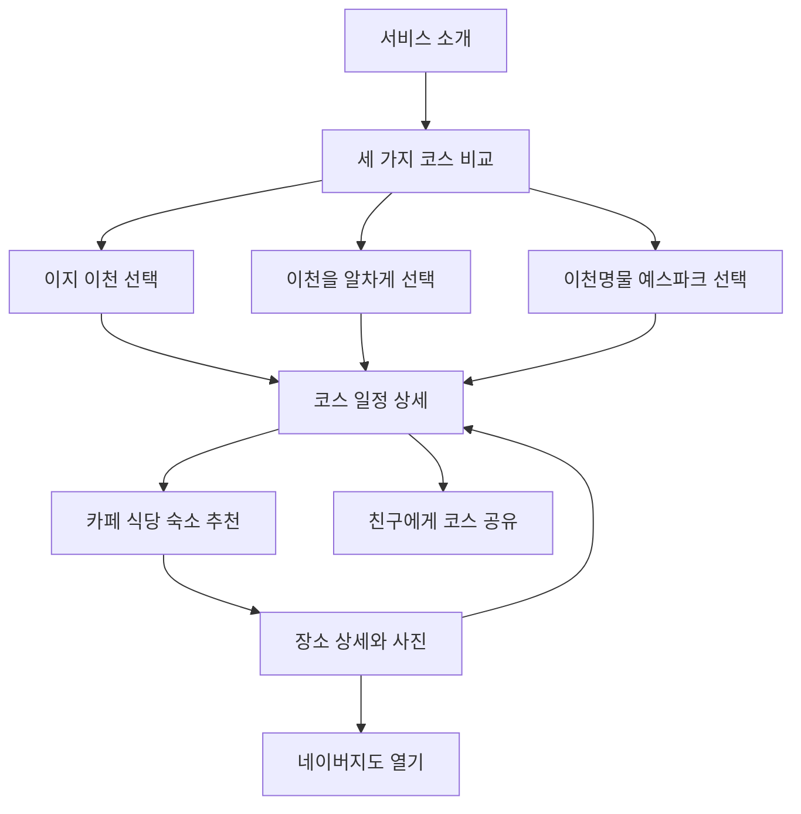

# 요즘 이천 하루만에 제품 요구사항 문서
상태: 완료
최근 수정: 2026-09-15

## 1 서비스 한 줄 소개

서울과 수도권에 살며 자가용 없이 친구와 처음 이천 당일치기를 계획하는 20대가 여행 취향에 맞는 검증된 하루 코스를 고르고, 구간별 경로와 이동시간 및 택시비를 확인하며 그대로 따라갈 수 있게 돕는 코스 안내 서비스다. 각 코스 주변의 카페, 식당과 숙소도 사진과 함께 살펴보고 주소에서 네이버지도를 열 수 있다.

## 2 타깃과 문제 및 대체재

### 핵심 타깃

서울과 수도권에 살며 자가용 없이 친구와 처음 이천 당일치기를 계획하는 20대다. 첨부 기획서의 대표 페르소나는 서울 구로에 거주하는 22세 대학생 강영미와 동성 친구다.

### 해결할 문제

- 관광지, 음식점, 카페 정보는 검색할 수 있지만 처음 방문하는 사람이 한정된 하루 안에 실행 가능한 순서로 직접 조합하기 어렵다.
- 버스 배차간격, 택시 이동, 구간별 시간과 비용을 함께 계산해야 해서 계획 부담이 크다.
- 처음 방문하는 사람은 예스파크처럼 선택지가 많은 장소에서 어디부터 볼지 판단하기 어렵다.

### 현재 대체재

- 네이버 지도와 카카오맵에서 장소를 각각 검색하고 동선을 직접 조합한다.
- 블로그와 SNS 후기를 여러 개 비교해 영업시간, 비용, 이동 방법을 따로 확인한다.
- 현장에서 버스 도착 정보나 택시 앱을 확인하며 일정을 수정한다.

## 3 핵심 기능과 부가 기능

### 핵심 기능 1 세 가지 하루 코스 비교

사용자가 편한 코스, 알찬 코스, 도자기 테마 코스의 전체 소요시간, 이동 난이도, 예상 교통비와 대표 경험을 한 화면에서 비교하고 직접 선택한다. 추천 질문에 답하게 하기보다 실행 가능성을 중심으로 세 코스의 차이를 이해하고 자신의 상황에 맞는 일정을 고를 수 있게 하는 서비스의 첫 번째 핵심 기능이다.

### 핵심 기능 2 시간순 전체 일정 안내

선택한 코스의 출발, 이동, 관광, 식사, 카페와 귀가 순서를 시간순으로 보여준다. 코스 전체 경로와 각 구간의 출발지, 도착지, 이동수단, 이동시간 및 예상 택시비를 함께 표시한다. 장소 영업시간과 휴무일, 체험 예약 필요 여부도 제공한다. 사용자가 다른 서비스에서 정보를 다시 조합하지 않고 하루 일정을 그대로 실행할 수 있게 하는 두 번째 핵심 기능이다.

### 코스별 주요 설명

#### 코스 1 이지 이천

전철과 택시를 이용해 짧은 동선으로 이천의 식사, 도자기와 베이커리 카페를 즐기는 코스다. 신도림역에서 전철로 약 1시간 30분 이동해 신둔도예촌역에 도착한 뒤 택시로 약 10분, 5.7km를 이동한다. 택시 왕복비는 약 25,000원이다.

이천의 명물인 강민주의들밥 직영점에서 17,000원 무한리필 식사를 한 뒤 바로 옆 이진상회로 이동한다. 이진상회에서는 특색 있는 베이커리 카페 공간에서 차를 마시고, 야외에 전시된 도자기를 관람하거나 쇼핑할 수 있다. 여러 관광지를 오가지 않고도 짧은 동선으로 이천을 즐길 수 있는 코스다.

전체 경로는 `신도림역 → 신둔도예촌역 경강선 → 강민주의들밥 직영점 → 이진상회 → 신둔도예촌역 → 귀가`다.

#### 코스 2 이천을 알차게

오전 9시 30분 이천역 또는 이천종합터미널에 도착해 설봉공원, 초원산방과 베이커리 을를을 차례로 방문한 뒤 오후 6시 30분에서 7시 사이에 이천역 또는 이천종합터미널로 돌아오는 하루 코스다.

시간표는 `09:30 이천 도착 → 10:00 설봉공원 도착 → 12:30 설봉공원 출발 → 13:40~14:00 초원산방 도착 → 16:00 초원산방 출발 → 16:10 베이커리 을를 도착 → 18:00 카페 출발 → 18:30~19:00 이천역 또는 이천종합터미널 도착`이다.

설봉공원 구간과 마지막 귀환 구간은 버스로도 갈 수 있지만 배차간격이 길다. 버스를 선택한 사용자는 출발 전에 버스 도착정보를 반드시 확인하도록 안내한다.

#### 코스 3 이천명물 예스파크

이천역에서 예스파크로 이동해 대표 공방을 둘러보고, 예스파크 안에서 식사와 티타임 및 도자기 체험을 한 뒤 이천역으로 돌아오는 테마 코스다.

전체 경로는 `이천역 → 예스파크 → 대표 공방 → 도자기 체험 → 예스파크 내 식사와 카페 → 이천역`이다. 추천 공방은 솔과흙(Pine&Clay), 토토, 토담과 라기환이다.

예스파크 안에서는 메밀국수 등 식당과 카페를 함께 추천한다. 숙소는 당일 일정에 포함하지 않고 예스파크 주변에서 머물 곳을 찾는 사용자를 위한 참고 정보로 제공한다.

### 첫 제품에 포함할 보조 기능

- 각 장소의 공식 정보 링크와 정보 확인일 표시
- 로그인 없이 현재 코스의 주소를 친구에게 공유
- 각 코스에서 가까운 카페, 식당과 숙소를 카테고리별로 최대 5곳까지 소개
- 추천 장소 카드에 대표 사진 1장, 장소 상세에 사진 3장에서 5장 제공
- 장소 주소와 `네이버지도에서 보기` 버튼에 확인된 네이버지도 장소 링크 연결
- 추천 장소가 코스의 어느 지점에서 가까운지와 도보 또는 택시 예상 이동시간 표시

### 이후 검토할 부가 기능

- 대표 공방과 공방별 특징, 체험 프로그램 소개
- 포토스폿 안내
- 음식점, 카페, 공방 교체
- 1인 예상 여행경비 계산

## 4 화면 목록과 이동 흐름

### 화면 목록

1. 서비스 소개: 현장답사 사진 3장에서 5장을 넘겨보는 대표 이미지 영역과 서비스 설명을 제공한다.
2. 코스 3개 비교: 코스별 대표 사진, 전체 경로, 전체 소요시간, 이동 난이도, 예상 택시비 합계와 대표 경험을 비교한다.
3. 선택 코스의 시간순 일정: 간단한 경로 그림, 구간별 이동시간과 택시비, 시간순 일정, 예상비용, 출발 전 확인사항 및 주변 추천을 제공한다. 주변 추천은 카페, 식당과 숙소 탭으로 구분한다.
4. 장소 상세: 사진 3장에서 5장, 설명, 주소, 코스 기준 이동시간, 영업시간, 휴무일, 공식 링크, 정보 확인일과 네이버지도 링크를 제공한다.

숙소는 당일치기 코스에 포함하지 않고 코스 주변 참고 정보로만 소개한다. 코스 공유는 시간순 일정 화면에서 제공한다.

## 5 저장할 데이터와 데이터 사용 원칙

### 저장할 데이터

- 코스 이름, 여행 스타일, 추천 대상, 전체 소요시간
- 코스 전체 경로, 이동 난이도, 예상 택시비 합계
- 장소 이름, 유형, 주소, 영업시간, 휴무일, 대표 특징
- 코스 안의 방문 순서와 권장 체류시간
- 구간별 출발지, 도착지, 이동수단, 예상 이동시간, 예상 택시비와 요금 확인일
- 체험 프로그램의 예약 필요 여부, 소요시간, 가격
- 주변 카페, 식당과 숙소의 기준 장소, 예상 거리 및 이동시간
- 장소별 대표 사진, 사진 목록, 대체 설명, 촬영자와 촬영일
- 장소 공식 링크, 정보 확인일과 네이버지도 장소 링크

### 코스별 초기 경로 데이터

#### 코스 1 이지 이천 이동 데이터

| 구간 | 이동수단 | 이동시간과 거리 | 비용과 안내 |
| --- | --- | --- | --- |
| 신도림역 → 신둔도예촌역 | 전철 경강선 | 약 1시간 30분 | 전철 운임은 이용 시점 기준으로 확인 |
| 신둔도예촌역 → 강민주의들밥 직영점 | 택시 권장 | 약 10분, 5.7km | 귀환 구간을 포함한 택시 왕복 약 25,000원 |
| 강민주의들밥 직영점 → 이진상회 | 도보 | 바로 옆 | 식비 17,000원, 무한리필 |
| 이진상회 → 신둔도예촌역 | 택시 | 정확한 시간은 공개 전 확인 | 앞 구간과 합쳐 왕복 약 25,000원 |
| 신둔도예촌역 → 신도림역 | 전철 경강선 | 약 1시간 30분 | 귀가 시간에 맞춰 전철 시간 확인 |

#### 코스 2 이천을 알차게 일정 데이터

| 예정 시각 | 일정 |
| --- | --- |
| 09:30 | 이천역 또는 이천종합터미널 도착 |
| 10:00 | 설봉공원 도착 |
| 10:00~12:30 | 설봉공원 권역 관람 |
| 12:30 | 설봉공원 출발 |
| 13:40~14:00 | 초원산방 도착 및 식사 |
| 16:00 | 초원산방 출발 |
| 16:10 | 베이커리 을를 도착 |
| 16:10~18:00 | 카페 이용 |
| 18:00 | 베이커리 을를 출발 |
| 18:30~19:00 | 이천역 또는 이천종합터미널 도착 |

#### 코스 2 이천을 알차게 이동 데이터

| 구간 | 택시 | 버스 또는 도보 | 안내 |
| --- | --- | --- | --- |
| 이천역 또는 이천종합터미널 → 설봉공원 | 약 6분, 2.5km, 약 5,400원 | 약 32분: 도보 3분 + 버스 8분 + 도보 20분 | 실제 출발지에 따라 시간과 요금 재확인 |
| 설봉공원 → 초원산방 | 약 12분, 4.8km, 약 9,000원 | 약 31분: 설봉공원 → 설봉공원삼거리 정류장 도보 14분 + 버스 10분 + 도보 5분 | 버스 배차간격 약 30~40분, 도착정보 확인 필수 |
| 초원산방 → 베이커리 을를 | 택시 이용 없음 | 도보 약 8분, 379m | 짧은 도보 이동 |
| 베이커리 을를 → 이천역 또는 이천종합터미널 | 약 6~9분, 1.9km, 약 5,000~7,000원 | 도보 약 29분 또는 버스 약 26분: 도보 3분 + 버스 18분 + 도보 3분 | 버스 배차간격 약 20~30분, 도착정보 확인 필수 |

코스 2의 택시비 합계는 제공된 구간을 기준으로 약 19,400원에서 21,400원이다.

#### 코스 3 이천명물 예스파크 이동 데이터

| 구간 | 이동수단 | 이동시간과 거리 | 예상 택시비 |
| --- | --- | --- | --- |
| 이천역 → 예스파크 | 택시 또는 버스 | 공개 전 확인 필요 | 공개 전 확인 필요 |
| 예스파크 대표 공방과 체험 및 식사와 카페 | 도보 중심 | 공방별 위치와 체류시간 확인 필요 | 택시 이용 없음 |
| 예스파크 → 이천역 | 택시 또는 버스 | 공개 전 확인 필요 | 공개 전 확인 필요 |

#### 코스 3 예스파크 주변 장소와 네이버지도 링크

카페는 소개 사진, 간단한 설명, 주소와 함께 표시하며 장소 주소 또는 `네이버지도에서 보기`를 누르면 아래 링크를 연다.

- [OUI 카페](https://naver.me/xWTnsuzl)
- [카페12인치](https://naver.me/x7nxkgNv)
- [카페웰콤](https://naver.me/G4WoOUXS)
- [카페 오르골](https://naver.me/FJbYsaTN)
- [잎새달카페](https://naver.me/FaezCVJA)

식당은 예스파크 안에서 메밀국수 등을 먹을 수 있는 장소로 소개하고 사진, 설명과 주소를 표시한다.

- [도예촌막국수](https://naver.me/xBwKgplw)

숙소는 예약 기능 없이 참고 정보로 소개한다.

- [갤러리 SO](https://naver.me/58qrEUni): 이천 도자예술마을 예스파크 중심에 있는 전시와 체류가 함께 가능한 복합 문화공간이자 일정 기간 머무를 수 있는 공간이다. 내부에는 서양화가 인순옥 배추작가의 작품이 전시된 갤러리가 연결되어 있다.

위 이동값은 사용자가 제공한 현장답사 기록을 옮긴 초기값이다. 모든 구간을 출발지와 도착지 단위로 다시 확인하며, 값이 없는 코스 3 구간은 시안에서 임의의 숫자를 넣지 않고 `확인 필요`로 표시한다.

### 데이터 사용 원칙

관광과 교통 정보는 공개된 공식 출처와 업체 공식 채널을 우선 사용한다. 가격, 영업시간, 휴무일, 이동시간과 택시비처럼 바뀔 수 있는 값에는 확인일과 출처를 함께 저장하고, 실시간성이 보장되지 않는 값은 예상치임을 표시한다. 택시비는 교통 상황과 호출 방식에 따라 달라질 수 있다는 안내를 붙인다.

현장답사 사진은 사용자가 직접 촬영한 원본만 사용하며, 인물 얼굴이나 차량번호가 식별되면 공개 전에 가림 처리한다. 장소 주소를 누르면 별도 창에서 확인된 네이버지도 장소 페이지를 연다. 네이버지도 API를 이용한 실시간 경로 계산은 첫 제품에 포함하지 않는다.

## 6 제외 범위

- 회원가입과 로그인
- 숙박이 포함된 1박 이상 일정 구성과 숙소 예약 기능. 단, 코스 주변 숙소 정보 소개는 포함한다.
- 자동차 운전 경로와 주차 최적화
- 교통편, 음식점, 공방 체험의 직접 예약과 결제
- 실시간 버스나 지하철 도착 정보 연동
- 장소 교체에 따른 시간, 비용과 동선의 자동 재계산
- 사용자가 장소를 무제한 추가하는 일정 편집기
- 이천 외 지역의 여행 코스

## 7 성공 기준

- 타깃 사용자 5명 중 4명 이상이 3분 안에 자신에게 맞는 코스 하나를 선택하고 전체 일정을 확인한다.
- 타깃 사용자 5명 중 4명 이상이 별도 검색 없이 선택한 코스의 경로, 구간별 이동시간과 예상 택시비를 찾고 설명할 수 있다.
- 타깃 사용자 5명 중 4명 이상이 주변 카페, 식당 또는 숙소의 사진을 확인한 뒤 주소에서 네이버지도를 열 수 있다.

## 8 예상 복잡도

보통 - 화면은 4개로 유지하고 로그인, 결제, 직접 예약과 실시간 교통 연동을 제외한다. 다만 코스별 구간 데이터, 카페·식당·숙소 추천과 여러 장의 사진을 관리해야 하므로 단순한 정적 코스 소개보다 콘텐츠 작업량이 크다.

복잡도를 높이는 요인은 사진 최적화, 변동 정보의 정기 확인, 실시간 교통 연동, 장소 교체에 따른 동선 재계산과 외부 예약 연동이다. 첫 제품에서는 검증된 고정 코스와 외부 네이버지도 링크를 중심으로 만들고 자동 계산과 예약은 제외한다.
